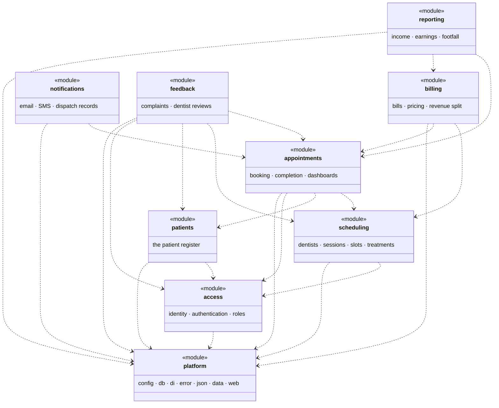
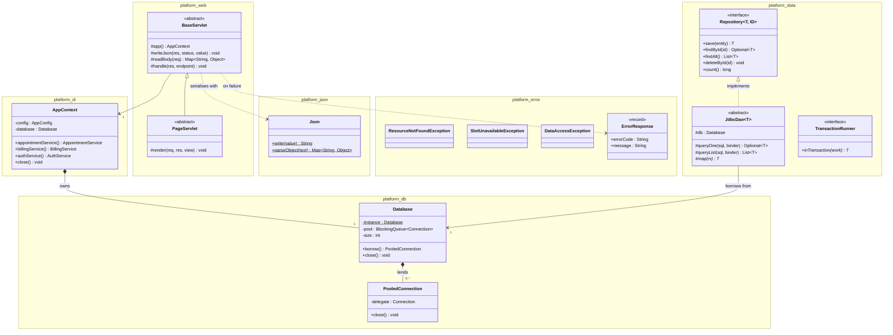

# Class Design

Class diagrams for the **modular** implementation of the Sunrise Dental Clinic system.

These describe the design the [SRS](srs/srs.md) specifies and the module structure that exists
in `modular/src/main/java/com/sunrise/clinic/` — seven feature modules plus `platform/`. They
are **not** a reverse-engineering of `layered/`: several classes here are specified in the SRS
and not yet written, and each is marked.

| | |
|---|---|
| Notation | UML 2.5 class diagrams, rendered with Mermaid |
| Grouping | By module — each labelled box is one package under `com.sunrise.clinic` |
| Sources | [`srs/srs.md`](srs/srs.md) §5, [`er-diagram.md`](er-diagram.md), the four role SRS documents |

---

## Reading these diagrams

| Notation | Meaning |
|---|---|
| `-` | private |
| `+` | public |
| `#` | protected |
| `~` | package-private |
| *italic* | abstract class or abstract method |
| <u>underlined</u> | static member |
| `<<interface>>` `<<abstract>>` `<<enumeration>>` `<<record>>` | stereotype |
| ◆——— filled diamond | **composition** — the part cannot exist without the whole and is destroyed with it |
| ◇——— hollow diamond | **aggregation** — the part belongs to the whole but outlives it |
| ———▶ solid arrow | association, arrowhead showing navigability |
| ┈┈▷ dashed arrow | dependency — uses, but holds no reference |
| ┈┈▷ hollow triangle | realisation — implements an interface |
| `1` `0..1` `1..*` `0..*` | multiplicity at that end |

Every association carries multiplicity at both ends and an arrowhead showing which direction it
can be navigated. Where a class holds only an id rather than a reference, the association is
still drawn — that is the design intent, and the id is the mechanism.

---

## 1. Module dependencies

Nine modules. An arrow means *may import from*; the absence of an arrow is a rule, not an
omission. `platform` depends on nothing, so it can be migrated and tested first, and
`feedback` depends on four others, so it is migrated last.



**No cycles, by design.** The graph is a DAG, which is what makes the migration order in the
plan possible and what stops a change to billing from reaching back into scheduling. Two rules
enforce it: a feature module never imports a *sibling's* `web` or `data` package, only its
`domain` and `service`; and `platform` never imports a feature module.

---

## 2. Domain model

The entities, grouped by the module that owns them. This is the diagram the assessment's
"class diagram" criterion refers to.

```mermaid
%% Sunrise Dental Clinic - class design: 2-domain-model
%% Source of truth: modular/docs/class-diagram.md

classDiagram
    direction TB

    namespace access {
        class UserAccount {
            -uid : String
            -accountNo : String
            -username : String
            -email : String
            -passwordHash : String
            -displayName : String
            -role : Role
            -active : boolean
            -failedAttempts : int
            -locked : boolean
            -createdAt : Instant
            +getUid() String
            +getRole() Role
            +isLocked() boolean
            +policy() RolePolicy
        }
        class Role {
            <<enumeration>>
            PATIENT
            RECEPTIONIST
            DENTIST
            ADMIN
        }
    }

    namespace feedback {
        class DentistReview {
            -id : String
            -appointmentNo : String
            -dentistId : String
            -patientId : String
            -rating : int
            -comment : String
            -submittedAt : Instant
            -updatedAt : Instant
            +isEditable(now) boolean
        }
        class RatingSummary {
            <<record>>
            +dentistId : String
            +mean : double
            +count : int
            +isPublishable() boolean
        }
        class Complaint {
            -id : String
            -patientId : String
            -dentistId : String
            -appointmentNo : String
            -category : ComplaintCategory
            -detail : String
            -status : ComplaintStatus
            -submittedAt : Instant
            -reviewedByUid : String
            -resolution : String
            -resolvedAt : Instant
            +isOpen() boolean
            +canTransitionTo(status) boolean
            +resolve(note, adminUid) void
        }
        class ComplaintCategory {
            <<enumeration>>
            CONDUCT
            CLINICAL_CONCERN
            WAIT_TIME
            BILLING
            OTHER
        }
        class ComplaintStatus {
            <<enumeration>>
            SUBMITTED
            UNDER_REVIEW
            RESOLVED
            DISMISSED
        }
    }

    namespace patients {
        class PatientNote {
            -id : String
            -patientId : String
            -category : NoteCategory
            -detail : String
            -critical : boolean
            -createdAt : Instant
            -updatedAt : Instant
            +isCritical() boolean
            +getCategory() NoteCategory
        }
        class NoteCategory {
            <<enumeration>>
            ALLERGY
            MEDICATION
            CONDITION
            OTHER
        }
        class Patient {
            -id : String
            -userUid : String
            -name : String
            -address : String
            -contactNumber : String
            -email : String
            -dob : LocalDate
            -diagnosisDetails : String
            -patientNo : String
            +getId() String
            +getName() String
            +getContactNumber() String
            +hasPortalAccount() boolean
        }
    }

    namespace scheduling {
        class Dentist {
            -id : String
            -userUid : String
            -name : String
            -specialization : String
            -phone : String
            -consultationFee : double
            -active : boolean
            +getConsultationFee() double
            +isActive() boolean
        }
        class DentistSession {
            -id : String
            -dentistId : String
            -date : LocalDate
            -startTime : LocalTime
            -endTime : LocalTime
            -slotDurationMinutes : int
            -publishedByUid : String
            +divideIntoSlots() List~Slot~
        }
        class Slot {
            -id : String
            -sessionId : String
            -dentistId : String
            -date : LocalDate
            -startTime : LocalTime
            -durationMinutes : int
            -status : SlotStatus
            -appointmentNo : String
            +isOpen() boolean
            +bookFor(appointmentNo) void
            +release() void
        }
        class Treatment {
            -id : String
            -name : String
            -description : String
            -baseCost : double
            -active : boolean
            +getBaseCost() double
        }
        class SlotStatus {
            <<enumeration>>
            OPEN
            BOOKED
        }
    }

    namespace appointments {
        class Appointment {
            -appointmentNo : String
            -patientId : String
            -dentistId : String
            -slotId : String
            -treatmentId : String
            -date : LocalDate
            -time : LocalTime
            -status : AppointmentStatus
            -diagnosis : String
            -patientReason : String
            -customPrice : double
            -createdByUid : String
            -createdByRole : Role
            -createdAt : Instant
            +getAppointmentNo() String
            +getDiagnosis() String
            +complete(diagnosis, customPrice) void
            +cancel() void
            +canTransitionTo(status) boolean
        }
        class AppointmentStatus {
            <<enumeration>>
            CONFIRMED
            COMPLETED
            BILLED
            CANCELLED
        }
    }

    namespace billing {
        class Bill {
            -id : String
            -appointmentNo : String
            -patientId : String
            -dentistId : String
            -receptionistUid : String
            -issuedAt : Instant
            -issuedByUid : String
            +getTotal() double
        }
        class BillBreakdown {
            <<record>>
            +consultationFee : double
            +treatmentCost : double
            +serviceCharge : double
            +discount : double
            +tax : double
            +total() double
        }
        class RevenueSplit {
            <<record>>
            +dentistEarning : double
            +clinicEarning : double
            +receptionistEarning : double
        }
    }

    namespace notifications {
        class Notification {
            -id : String
            -appointmentNo : String
            -channel : ChannelType
            -recipient : String
            -subject : String
            -body : String
            -status : NotificationStatus
            -sentAt : Instant
        }
        class ChannelType {
            <<enumeration>>
            EMAIL
            SMS
        }
        class NotificationStatus {
            <<enumeration>>
            SENT
            FAILED
            LOGGED
        }
    }

    namespace platform {
        class AuditEvent {
            -id : String
            -actorUid : String
            -actorRole : Role
            -action : String
            -targetType : String
            -targetId : String
            -timestamp : Instant
        }
    }

    Patient *-- "0..*" PatientNote : declares
    Patient "1" --> "0..*" Complaint : raises
    Dentist "1" --> "0..*" Complaint : named in
    Complaint --> "1" ComplaintCategory
    Complaint --> "1" ComplaintStatus

    Appointment "1" --> "0..1" DentistReview : rated by
    Dentist "1" --> "0..*" DentistReview : rated
    Patient "1" --> "0..*" DentistReview : writes
    PatientNote --> "1" NoteCategory

    UserAccount --> "1" Role : has
    UserAccount o-- "0..1" Patient : profile
    UserAccount o-- "0..1" Dentist : profile

    Dentist *-- "0..*" DentistSession : works
    DentistSession *-- "1..*" Slot : divides into
    Slot --> "1" SlotStatus

    Appointment --> "1" Patient : for
    Appointment --> "1" Dentist : treated by
    Appointment --> "0..1" Treatment : of type
    Appointment --> "1" AppointmentStatus
    Slot "0..1" <--> "0..1" Appointment : booked as

    Appointment *-- "0..1" Bill : billed by
    Appointment *-- "0..*" Notification : triggers

    Bill *-- "1" BillBreakdown : itemises
    Bill *-- "1" RevenueSplit : divides into
    Notification --> "1" ChannelType
    Notification --> "1" NotificationStatus

    AuditEvent --> "0..1" UserAccount : actor
```



### Why each relationship is drawn as it is

The assessment criterion asks for multiplicity, navigability, aggregation and composition to be
visible. Each choice below is a judgement, not decoration.

| Relationship | Kind | Reasoning |
|---|---|---|
| `UserAccount` ◇ `Patient` | **Aggregation** | A patient record exists without an account — a walk-in registered at the desk (**ASM-04**). The profile belongs to the identity but outlives it, so the diamond is hollow |
| `UserAccount` ◇ `Dentist` | **Aggregation** | A dentist is in the register before a login is issued, so `userUid` is nullable |
| `Dentist` ◆ `DentistSession` | **Composition** | A session is meaningless without its dentist and is destroyed with them — the schema says `ON DELETE CASCADE` |
| `DentistSession` ◆ `Slot` | **Composition** | Slots are cut from the session and cannot outlive it; also `ON DELETE CASCADE` |
| `Patient` ◆ `PatientNote` | **Composition** | A medical note is meaningless without the patient it describes, and cascades on delete. `0..*` because most patients declare nothing |
| `Patient` ▶ `Complaint` | **Association**, not composition | A complaint is a record of governance, not a part of the patient. It must survive tidying of the appointment it concerns (**FR-DAT-06**), and drawing it as composition would imply it can be discarded with the patient |
| `Dentist` ▶ `Complaint` | **Association**, one-directional | Navigable from the complaint to the dentist named, and **never** the other way. That absent arrowhead is **FR-CMP-08**: there is no query path from a dentist to complaints about them |
| `Appointment` ▶ `DentistReview` | **Association**, `0..1` | One review per visit, enforced by `UNIQUE (appointment_no)` rather than application logic (**FR-DAT-07**) |
| `Patient` ▶ `DentistReview` | **Association**, one-directional | Navigable to the author, never from the dentist. The dentist reads `RatingSummary`, which has no author field to reach through (**NFR-SEC-13**) |
| `Appointment` ◆ `Bill` | **Composition** | One bill per appointment, cascading. `0..1` because a bill exists only after completion |
| `Appointment` ◆ `Notification` | **Composition** | A dispatch record has no meaning detached from its appointment |
| `Bill` ◆ `BillBreakdown`, `RevenueSplit` | **Composition** | Value objects created with the bill and never shared |
| `Appointment` ▶ `Patient` / `Dentist` / `Treatment` | **Association** | A reference, not a part. All three outlive any one appointment, which is exactly why the fields are ids and the data is normalised (**FR-DAT-01**) |
| `Slot` ◀▶ `Appointment` | **Bidirectional association** | The one place navigability runs both ways: `slot.appointmentNo` and `appointment.slotId`. This is the deliberate circular reference the ER design explains — a foreign key in both directions makes the insert impossible, so integrity comes from `UNIQUE (slot.appointment_no)` plus a row lock instead |
| `AuditEvent` ▶ `UserAccount` | **Association, `0..1`** | `0..1` because the actor may be a deleted account and the trail must survive them |

### Behaviour moved onto the entities

The domain classes in `layered/` are data holders with getters and setters. The modular design
gives them the behaviour that belongs to them, which is what makes them objects rather than
records with a class keyword:

| Method | Belongs here because |
|---|---|
| `Slot.isOpen()`, `bookFor()`, `release()` | Only the slot knows what makes it bookable. Today a service sets `status` from outside |
| `Appointment.canTransitionTo(status)` | Closes **FR-APT-08**: the status machine lives in one place instead of being unenforced across servlets |
| `Appointment.complete()`, `cancel()` | A transition is the object's own business |
| `DentistSession.divideIntoSlots()` | The slot arithmetic is a property of the session, not of `SlotService` |
| `Patient.hasPortalAccount()` | Derives what reception needs (**FR-REC-22**) without exposing `userUid` |
| `PatientNote.isCritical()` | The note itself decides whether it warrants a banner, rather than every screen re-deriving it |
| `Complaint.canTransitionTo(status)` | The state machine lives on the entity, so `SUBMITTED → RESOLVED` without review cannot be reached from a servlet |
| `Complaint.resolve(note, adminUid)` | Closing requires a resolution and an actor together — the object refuses to be closed silently (**FR-ADM-53**) |
| `DentistReview.isEditable(now)` | The 30-day window is the review's own rule, not a date comparison scattered through servlets (**FR-PAT-63**) |
| `RatingSummary.isPublishable()` | Encodes the five-review floor (**FR-RVW-12**), so no caller can accidentally show a mean drawn from one visit |
| `UserAccount.policy()` | The entry point to polymorphic authorisation (**FR-OOP-04**) |

---

## 3. `access` — authentication, roles, accounts

Two hierarchies. The servlet hierarchy removes the duplication of four sign-in pages; the policy
hierarchy removes 28 conditionals.

```mermaid
%% Sunrise Dental Clinic - class design: 3-access
%% Source of truth: modular/docs/class-diagram.md

classDiagram
    direction TB

    namespace platform_web {
        class BaseServlet {
            <<abstract>>
            #app() AppContext
            #currentUser(req) ClinicPrincipal
            #handle(res, endpoint) void
        }
        class PageServlet {
            <<abstract>>
            #render(req, res, view) void
        }
    }

    namespace access_web {
        class AbstractLoginServlet {
            <<abstract>>
            +doGet(req, res) void
            +doPost(req, res) void
            #acceptedRole()* Role
            #viewName()* String
            #allowsSelfRegistration() boolean
            #auditFailedAttempts() boolean
            -usernamePortal() boolean
        }
        class StaffPortalServlet {
            +doGet(req, res) void
        }
        class RegisterServlet {
            +doGet(req, res) void
            +doPost(req, res) void
        }
        class HelpServlet {
            +doGet(req, res) void
        }
        class LogoutServlet {
            +doGet(req, res) void
            +doPost(req, res) void
        }
        class PatientLoginServlet {
            #acceptedRole() Role
            #viewName() String
            #allowsSelfRegistration() boolean
        }
        class ReceptionLoginServlet {
            #acceptedRole() Role
            #viewName() String
        }
        class DentistLoginServlet {
            #acceptedRole() Role
            #viewName() String
        }
        class AdminLoginServlet {
            #acceptedRole() Role
            #viewName() String
            #auditFailedAttempts() boolean
        }
        class AuthenticationFilter {
            -PUBLIC_PREFIXES : List~String~$
            +doFilter(req, res, chain) void
            +establishSession(req, principal)$ void
            +clearSession(req)$ void
        }
    }

    namespace access_service {
        class AuthService {
            -users : UserRepository
            -hasher : PasswordHasher
            -attempts : LoginAttemptService
            +login(identifier, password) LoginResult
            +unlock(email) void
        }
        class UserAccountFactory {
            -users : UserRepository
            -patients : PatientRepository
            -dentists : DentistRepository
            +createStaff(email, password, displayName, role, username) UserAccount
            +validUsername(username) String
        }
        class PasswordHasher {
            -ITERATIONS : int$
            +hash(password)$ String
            +matches(password, stored)$ boolean
        }
        class LoginAttemptService {
            -MAX_ATTEMPTS : int$
            +recordFailure(email) LockStatus
            +status(email) LockStatus
        }
        class AccessControl {
            +require(user, action)$ void
        }
    }

    namespace access_domain {
        class RolePolicy {
            <<abstract>>
            +role()* Role
            +homePath()* String
            +loginPath()* String
            +navigation() List~NavItem~
            +permits(action)* boolean
        }
        class PatientPolicy
        class ReceptionPolicy
        class DentistPolicy
        class AdminPolicy
        class Action {
            <<enumeration>>
            BOOK_OWN
            BOOK_FOR
            CANCEL_OWN
            REGISTER_PATIENT
            PUBLISH_AVAILABILITY
            RECORD_DIAGNOSIS
            COMPLETE_TREATMENT
            EDIT_OWN_PROFILE
            RAISE_CONCERN
            ISSUE_BILL
            READ_REPORTS
            MANAGE_ACCOUNTS
            MANAGE_CLINIC_SETTINGS
            READ_AUDIT
        }
        class ClinicPrincipal {
            <<record>>
            +uid : String
            +displayName : String
            +role : Role
            +policy() RolePolicy
        }
    }

    namespace access_data {
        class UserRepository {
            <<interface>>
            +findByEmail(email) Optional~UserAccount~
            +findByUsername(username) Optional~UserAccount~
            +findStaff() List~UserAccount~
        }
        class UserDao {
            -db : Database
            +save(user) UserAccount
            +findByEmail(email) Optional~UserAccount~
            +findByUsername(username) Optional~UserAccount~
        }
    }

    BaseServlet <|-- PageServlet
    PageServlet <|-- AbstractLoginServlet
    AbstractLoginServlet <|-- PatientLoginServlet
    AbstractLoginServlet <|-- ReceptionLoginServlet
    AbstractLoginServlet <|-- DentistLoginServlet
    AbstractLoginServlet <|-- AdminLoginServlet
    PageServlet <|-- StaffPortalServlet
    PageServlet <|-- RegisterServlet
    PageServlet <|-- HelpServlet
    PageServlet <|-- LogoutServlet

    RolePolicy <|-- PatientPolicy
    RolePolicy <|-- ReceptionPolicy
    RolePolicy <|-- DentistPolicy
    RolePolicy <|-- AdminPolicy
    RolePolicy ..> Action : evaluates

    AbstractLoginServlet --> "1" AuthService : authenticates with
    AbstractLoginServlet ..> RolePolicy : redirects by
    AuthService --> "1" UserRepository
    AuthService --> "1" PasswordHasher
    AuthService --> "1" LoginAttemptService
    UserRepository <|.. UserDao : implements
    UserAccountFactory ..> UserRepository
    AccessControl ..> RolePolicy : delegates to
    ClinicPrincipal --> "1" RolePolicy
```



**The Template Method.** `AbstractLoginServlet.doPost` is concrete and holds the whole sequence:
read credentials → `AuthService.login()` → reject if the role is not `acceptedRole()` → establish
the session → redirect to `policy().homePath()`. The two italicised methods are abstract and each
subclass must supply them; `allowsSelfRegistration()` and `auditFailedAttempts()` are hooks with
defaults. Each subclass is four to six lines, and the role check that makes separate portals safe
exists exactly once (**FR-OOP-11**, **FR-AUTH-03**).

**Underlined members are static.** `PasswordHasher.hash`, `AuthenticationFilter.establishSession`
and `AccessControl.require` are stateless utilities; `PUBLIC_PREFIXES`, `ITERATIONS` and
`MAX_ATTEMPTS` are constants.

| Class | Status |
|---|---|
| `AbstractLoginServlet` and the four portals, `PortalChooserServlet` | **New** — FR-AUTH-01…03, FR-OOP-11 |
| `RolePolicy` and the four policies, `Action` | **New** — FR-OOP-04 |
| `UserAccountFactory` | **New** — FR-ADM-20…22 |
| `AuthService`, `PasswordHasher`, `LoginAttemptService`, `AuthenticationFilter`, `UserRepository`, `UserDao` | Exists, reused unchanged |
| `AccessControl` | Exists; signature changes from `require(user, Role…)` to `require(user, Action)` |

---

## 4. `appointments` — one module, all three tiers

Shown in full because it is the module that demonstrates the architecture: presentation, business
and data inside one feature, with no sibling module's internals reached into.

```mermaid
%% Sunrise Dental Clinic - class design: 4-appointments
%% Source of truth: modular/docs/class-diagram.md

classDiagram
    direction TB

    namespace appointments_web {
        class BookAppointmentServlet {
            -service : AppointmentService
            +doGet(req, res) void
            +doPost(req, res) void
        }
        class PatientHomeServlet {
            +doGet(req, res) void
        }
        class ReceptionDayServlet {
            +doGet(req, res) void
        }
        class DentistScheduleServlet {
            +doGet(req, res) void
        }
        class AppointmentApiServlet {
            +doGet(req, res) void
            +doPost(req, res) void
        }
    }

    namespace appointments_service {
        class AppointmentService {
            -appointments : AppointmentRepository
            -slots : SlotRepository
            -numbers : AppointmentNumberGenerator
            -publisher : AppointmentEventPublisher
            -tx : TransactionRunner
            +book(patientId, slotId, treatmentId, actor) Appointment
            +findByNo(no) Appointment
            +findForPatient(patientId) List~Appointment~
            +findForDentist(dentistId, date) List~Appointment~
            +complete(no, diagnosis, customPrice) Appointment
            +cancel(no, actor) Appointment
        }
        class AppointmentNumberGenerator {
            -counters : CounterRepository
            +nextFor(date) String
        }
        class AppointmentEventPublisher {
            -observers : List~AppointmentObserver~
            +register(observer) void
            +publish(event) void
        }
        class AppointmentObserver {
            <<interface>>
            +onAppointmentEvent(event) void
        }
        class AppointmentEvent {
            <<record>>
            +type : EventType
            +appointment : Appointment
            +actorUid : String
        }
        class ClinicAccess {
            +canViewClinical(appointment, user) boolean
            +canViewPatientNotes(patientId, user) boolean
        }
    }

    namespace appointments_data {
        class AppointmentRepository {
            <<interface>>
            +findByPatientId(id) List~Appointment~
            +findByDentistId(id) List~Appointment~
            +findByDate(date) List~Appointment~
        }
        class AppointmentDao {
            -db : Database
            +save(appointment) Appointment
            +findById(no) Optional~Appointment~
        }
        class InMemoryAppointmentRepository {
            -store : Map~String, Appointment~
        }
    }

    namespace appointments_domain {
        class Appointment {
            -status : AppointmentStatus
            -diagnosis : String
            +canTransitionTo(status) boolean
            +complete(diagnosis) void
            +cancel() void
        }
        class AppointmentResponse {
            <<record>>
            +appointmentNo : String
            +date : LocalDate
            +status : AppointmentStatus
        }
        class AppointmentDetailResponse {
            <<record>>
            +appointmentNo : String
            +treatmentId : String
            +patientReason : String
            +diagnosis : String
            +patientNotes : List~PatientNoteResponse~
        }
    }

    BookAppointmentServlet --> "1" AppointmentService
    PatientHomeServlet --> "1" AppointmentService
    ReceptionDayServlet --> "1" AppointmentService
    DentistScheduleServlet --> "1" AppointmentService
    AppointmentApiServlet --> "1" AppointmentService
    AppointmentApiServlet ..> ClinicAccess : chooses response by

    AppointmentService --> "1" AppointmentRepository
    AppointmentService --> "1" AppointmentNumberGenerator
    AppointmentService --> "1" AppointmentEventPublisher
    AppointmentService ..> Appointment : creates

    AppointmentRepository <|.. AppointmentDao : implements
    AppointmentRepository <|.. InMemoryAppointmentRepository : implements

    AppointmentEventPublisher o-- "0..*" AppointmentObserver : notifies
    AppointmentEventPublisher ..> AppointmentEvent
    ClinicAccess ..> AppointmentDetailResponse : permits
    ClinicAccess ..> AppointmentResponse : otherwise
```



**Three design points this diagram makes:**

**Every servlet talks to the service, never to a repository.** That is **NFR-MNT-02**, and it is
the single largest correction over `layered/`, where 12 of 20 servlets reach a repository
directly. The arrows in this diagram are the requirement drawn.

**The repository interface has two implementations.** `AppointmentDao` for production,
`InMemoryAppointmentRepository` for tests. Same interface, chosen at wiring time, no caller
changes — **FR-OOP-03**, and the reason 48 tests run with no database.

**The Observer keeps notification out of booking.** `AppointmentService` publishes an event and
does not know who listens; `notifications` and `platform/audit` register observers. Cost, stated
because the pattern register demands it: the booking flow no longer names what happens next.

**The confidentiality boundary is a type, not a condition.** `ClinicAccess` selects between
`AppointmentDetailResponse` and `AppointmentResponse`. The clinical fields are absent from the
object rather than hidden by a view, so they cannot leak by oversight — **FR-OOP-07**,
**NFR-SEC-06**.

Two fields ride that boundary, and they come from different places:

| Field | Source | Who may see it |
|---|---|---|
| `diagnosis` | `appointment` — written by the dentist, one visit | treating dentist, the patient |
| `patientNotes` | `patient_note` — written by the **patient**, persistent across visits | treating dentist, the patient |

`ClinicAccess.canViewClinical()` gates both with one decision, so there is no way to be
authorised for one and not the other. Reception and the administrator receive
`AppointmentResponse`, which has a field for neither.

---

## 5. `billing` and `notifications` — interchangeable algorithms

Both modules exist to show the same idea: behaviour that varies is an object, not a branch.

```mermaid
%% Sunrise Dental Clinic - class design: 5-billing-notifications
%% Source of truth: modular/docs/class-diagram.md

classDiagram
    direction TB

    namespace billing_service {
        class BillingService {
            -bills : BillRepository
            -appointments : AppointmentRepository
            -pricing : BillingStrategy
            -split : RevenueSplitStrategy
            -serviceCharge : Supplier~BigDecimal~
            +issue(no, issuedByUid) Bill
            +findForAppointment(no) Optional~Bill~
        }
        class BillingStrategy {
            <<interface>>
            +calculate(fee, cost, charge)* BillBreakdown
        }
        class StandardBillingStrategy {
            +calculate(fee, cost, charge) BillBreakdown
        }
        class RevenueSplitStrategy {
            <<interface>>
            +split(breakdown)* RevenueSplit
        }
        class DefaultRevenueSplitStrategy {
            -dentistShare : Supplier~BigDecimal~
            -receptionistShare : Supplier~BigDecimal~
            +split(breakdown) RevenueSplit
        }
    }

    namespace notifications_service {
        class NotificationObserver {
            -factory : NotificationChannelFactory
            -notifications : NotificationRepository
            +onAppointmentEvent(event) void
        }
        class NotificationChannelFactory {
            +channelFor(type) NotificationChannel
        }
        class NotificationChannel {
            <<interface>>
            +send(recipient, subject, body)* DispatchResult
        }
        class EmailChannel {
            -from : String
            +send(recipient, subject, body) DispatchResult
        }
        class SmsChannel {
            -gatewayUrl : String
            +send(recipient, subject, body) DispatchResult
        }
        class DispatchResult {
            <<record>>
            +status : NotificationStatus
            +detail : String
        }
    }

    BillingService --> "1" BillingStrategy : prices with
    BillingService --> "1" RevenueSplitStrategy : divides with
    BillingStrategy <|.. StandardBillingStrategy
    RevenueSplitStrategy <|.. DefaultRevenueSplitStrategy

    NotificationObserver --> "1" NotificationChannelFactory
    NotificationChannelFactory ..> NotificationChannel : creates
    NotificationChannel <|.. EmailChannel
    NotificationChannel <|.. SmsChannel
    NotificationChannel ..> DispatchResult
```



`BillingService` **has** a strategy — composition, not inheritance. There is no
`DiscountedBillingService` subclass, because pricing is a thing the service uses rather than a
kind of service it is (**FR-OOP-08**, §5.6 of the SRS).

`NotificationChannelFactory` is the only place that decides which channel a `ChannelType` means,
so adding WhatsApp is one new class and one case, with no change to `NotificationObserver`.

---

## 6. `platform` — the shared abstractions

Everything with no business meaning. Depends on nothing, which is why it migrates first.



**`Repository<T, ID>` is generic**, so one interface serves ten entities and `JdbcDao<T>` supplies
the query plumbing once. The abstract `map(rs)` is the only method each concrete DAO must write —
Template Method again, at the data tier.

**`Database` ◆ `PooledConnection`** is composition: a pooled connection is created by the pool,
returns to it on `close()`, and cannot outlive it. `AppContext` ◆ `Database` likewise — the
context builds the pool at start-up and closes it at shutdown.

**Three directories must be added** to `modular/src/main/java/com/sunrise/clinic/platform/`,
which currently holds only `config`, `db`, `di`, `error` and `json`: `data/`, `web/` and
`audit/`. Flagged rather than assumed.

---

## 7. Assumptions

Recorded because the marking criteria ask for diagrams "supported by relevant assumptions".

| # | Assumption | Effect on the diagram |
|---|---|---|
| 1 | A person holds exactly one role | `UserAccount` has a single `role` field, not a collection. Revisit if a dentist becomes a patient of the clinic |
| 2 | Entities reference each other by id, not by object | Associations are drawn but no class holds another entity as a field. Keeps aggregates independently loadable over plain JDBC |
| 3 | A patient record may exist with no account | Makes `UserAccount`–`Patient` aggregation rather than composition |
| 4 | Slot length is fixed within a session | `slotDurationMinutes` sits on `DentistSession`, not on each `Slot` |
| 5 | A bill records amounts, not references to prices | `Bill` composes `BillBreakdown`; a later price change cannot alter an issued bill (**FR-ADM-43**) |
| 6 | Notification delivery is best-effort | `Notification` records an outcome and is composed into the appointment, never blocking it |
| 7 | The audit trail outlives the accounts it names | `AuditEvent → UserAccount` is `0..1`, not `1` |
| 8 | Medical notes are written by the patient, not by staff | `PatientNote` has no author field — the owning `patientId` *is* the author. A staff-authored clinical note is `appointment.diagnosis`, a separate field on a separate entity |
| 9 | A note applies to the patient, not to one visit | `PatientNote` hangs off `Patient`, not `Appointment`, so an allergy declared once is visible at every future appointment |
| 10 | A named complaint is attributed; a general concern is anonymous | `Complaint` holds `patientId` for a named concern so it can be followed up. A general concern about the clinic names no dentist and stores NULL identities precisely because there is nobody to follow up with — only the account itself to act on |
| 11 | Only the state and resolution of a complaint are staff-writable | `detail` has no setter; `resolve()` writes only `status`, `resolution` and `reviewedByUid` (**FR-ADM-55**) |
| 12 | A rating belongs to a visit, not to a dentist | `DentistReview` keys on `appointmentNo`, so a second visit is a second rating and the mean reflects visits rather than opinions |
| 13 | The dentist's view of reviews is a different type, not a filtered one | `RatingSummary` is a separate record rather than `DentistReview` with fields nulled — a nulled field can be un-nulled by a later edit; a missing field cannot |

---

## 8. Traceability

| Requirement | Structure that satisfies it | Diagram |
|---|---|---|
| FR-AUTH-01…03 | `AbstractLoginServlet` + four portal subclasses | §3 |
| FR-OOP-01 | Private fields with accessors throughout | §2 |
| FR-OOP-02 | Services depend on `*Repository` interfaces | §4 |
| FR-OOP-03 | `AppointmentDao` and `InMemoryAppointmentRepository` on one interface | §4 |
| FR-OOP-04 | `RolePolicy` hierarchy and `Action` | §3 |
| FR-OOP-05, FR-OOP-06 | `BaseServlet` → `PageServlet` → `AbstractLoginServlet`; `JdbcDao.map()` | §3, §6 |
| FR-OOP-07 | `AppointmentResponse` vs `AppointmentDetailResponse` | §4 |
| FR-OOP-08 | `BillingStrategy`, `RevenueSplitStrategy` | §5 |
| FR-APT-08 | `Appointment.canTransitionTo()` | §2 |
| FR-ADM-20…22 | `UserAccountFactory` | §3 |
| FR-DAT-01 | Id-based associations, no duplicated patient fields | §2 |
| NFR-MNT-01 | Module boundaries and the acyclic dependency graph | §1 |
| NFR-MNT-02 | Every servlet arrow points at a service | §4 |
| NFR-MNT-03 | In-memory repository implementations | §4, §6 |
| NFR-SEC-06 | `ClinicAccess` selecting the response type | §4 |
| FR-NOTE-01…12 | `PatientNote` · `NoteCategory` · `PatientNoteService` · `PatientNoteRepository` | §2, §4 |
| FR-CMP-01…12 | `Complaint` · `ComplaintCategory` · `ComplaintStatus` in the `complaints` module | §1, §2 |
| FR-CMP-08 | The one-directional `Dentist → Complaint` association | §2 |
| NFR-SEC-12 | `ComplaintResponse` served only to patient and admin | §2 |
| FR-RVW-01…12 | `DentistReview` · `RatingSummary` in the `feedback` module | §1, §2 |
| NFR-SEC-13 | `RatingSummary` has no author or comment field for a dentist's response to carry | §2 |
| NFR-SEC-11 | `canViewPatientNotes()` — one gate for both clinical fields | §4 |

---

## 9. Regenerating

Each diagram is Mermaid, which GitHub renders inline, so a design change is a reviewable text
diff. Standalone sources are in [`class-diagram/`](class-diagram/) alongside rendered PNGs for
the report. Render locally with the Mermaid CLI (needs a Chrome binary for its headless
browser; without one, `https://mermaid.ink` renders the same sources — minify to fit URL
limits on the two largest). The PlantUML use-case and sequence sources render with
`java -jar plantuml.jar`, which needs no extra tooling:

```bash
java -jar plantuml.jar -o renders/use-case use-case/*.puml
java -jar plantuml.jar -o renders/sequence sequence/*.puml
```
