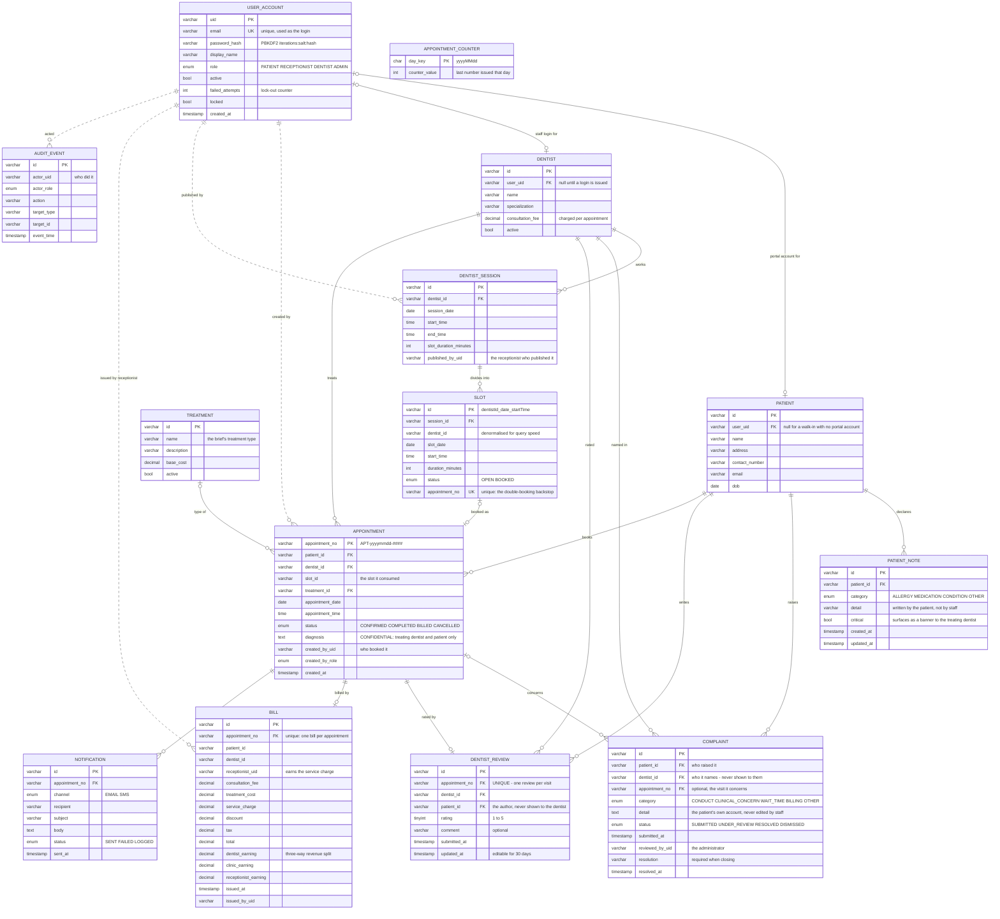

# Entity–Relationship Design

Database design for the Sunrise Dental Clinic Appointment & Patient Management System.
Fourteen tables, MySQL 8, InnoDB throughout.

This document is generated from the live schema in
[`../../layered/src/main/resources/schema.sql`](../../layered/src/main/resources/schema.sql) — if the two ever
disagree, the schema is right and this file is stale.

---

## 1. Tracing the brief to the schema

The assessment brief specifies one flat record for a new appointment:

> Store patient and appointment details including: appointment number, patient name,
> address, contact number, dentist name, treatment type, appointment date and time.

Storing those eight fields on a single table would repeat a patient's address, contact
number and dentist's name on every appointment they ever attend — an update anomaly waiting
to happen, and the exact failure the clinic already suffers with paper files. The schema
therefore distributes them across four tables, each field held once:

| Brief requirement | Where it lives | Why there |
|---|---|---|
| Appointment number | `appointment.appointment_no` **PK** | Natural key, format `APT-yyyymmdd-####`, generated per day from `appointment_counter` |
| Patient name | `patient.name` | Belongs to the person, not the visit — one row per patient however many visits |
| Address | `patient.address` | Same: changes once when the patient moves, not per appointment |
| Contact number | `patient.contact_number` | Same, and it is what the SMS reminder reads |
| Dentist name | `dentist.name` | Belongs to the practitioner; `appointment` references them by `dentist_id` |
| Treatment type | `treatment.name`, via `appointment.treatment_id` | A priced catalogue entry, not free text — this is what makes the bill calculable |
| Appointment date | `appointment.appointment_date` | On the visit |
| Appointment time | `appointment.appointment_time` | On the visit |

Two fields the brief needs for billing that are not in its own list:

| Needed for | Where it lives |
|---|---|
| Consultation fee | `dentist.consultation_fee` — varies per practitioner |
| Treatment cost | `treatment.base_cost`, totalled into `bill.total` |

**Design decision.** The brief's flat record is denormalised. The schema is in third normal
form: every non-key attribute depends on its own table's key and nothing else. The cost is
that displaying one appointment requires a four-way join; the benefit is that a patient's
contact number has exactly one authoritative value, which is the whole point of replacing
the notebooks.

---

## 2. The diagram

Relationship lines carry meaning:

- **Solid (`--`)** — enforced by a `FOREIGN KEY` constraint. The database rejects an orphan.
- **Dotted (`..`)** — a reference held as a plain column with no constraint. Integrity is
  the application's responsibility. See §4.



`APPOINTMENT_COUNTER` stands alone by design — it is a sequence generator, not an entity.
`AppointmentNumberGenerator` increments the row for today's date inside the booking
transaction, which is what makes appointment numbers gapless and unique per day without
relying on `AUTO_INCREMENT`.

---

## 3. How the four roles reach the data

The brief describes a staff-operated system. The implementation keeps that and adds a
patient self-service portal, which the brief permits: *"Additional functionalities can be
included as needed."*

Roles are **not** separate entities. All four are rows in `user_account` distinguished by
the `role` column. `PATIENT` and `DENTIST` additionally have a profile table, because they
carry attributes the account does not: a patient has an address and a date of birth, a
dentist has a specialization and a consultation fee. `RECEPTIONIST` and `ADMIN` carry no
attributes beyond name, email and role — all already on `user_account` — so giving them
their own tables would create rows with nothing in them.

| Role | Reads | Writes |
|---|---|---|
| **Patient** | own `appointment`, own `bill`, **own `patient_note`**, **own `complaint`**, **own `dentist_review`**, `slot` (open only), `dentist`, `treatment` | `appointment` (book, cancel), own `patient` row at registration, **own `patient_note`**, **insert `complaint`** |
| **Receptionist** | all `patient`, `appointment`, `slot`, `dentist`, `treatment`. **Never `patient_note`, never `complaint`, never `dentist_review`** | `patient` (walk-in), `dentist_session` + `slot` (publish availability), `appointment` (book on behalf), `bill` (issue) |
| **Dentist** | own `slot`, own `appointment` incl. `diagnosis`, **`patient_note` for patients on their own schedule**. **Never `complaint`, including complaints naming them**. **`dentist_review` as an aggregate only** — mean and count, never a row | `appointment.diagnosis`, `appointment.status` → `COMPLETED` |
| **Admin** | `bill` and `appointment` aggregates, `user_account`, `audit_event`, **all `complaint`**, **all `dentist_review`** including comments. **Never `patient_note`** | `user_account` (unlock, deactivate), `complaint.status` and `complaint.resolution` |

Three constraints are enforced in code rather than in the schema, and all three are worth
stating in the report:

- **`appointment.diagnosis` is field-level confidential.** Only the treating dentist and the
  patient may see it. Enforced by serving a different DTO to everyone else, so the column
  cannot leak through a shared response object by accident.
- **`patient_note` is confidential at the table level**, not the field level. It is readable
  only by the patient who wrote it and by a dentist treating them. Reception books the
  appointment without ever learning the patient is allergic to penicillin; the administrator
  reads revenue without seeing any clinical fact. Enforced the same way — no response object
  served to those roles carries a field for it.
- **`complaint` is confidential in the opposite direction to `patient_note`.** The administrator
  reads it; the dentist it names never does, and neither does reception. Two tables, two rules
  pointing opposite ways, and neither follows from seniority — access follows purpose. The
  dentist has clinical need of an allergy; independence requires that the subject of a complaint
  cannot read it.
- **`dentist_review` is the one table read at three different resolutions.** The administrator
  reads rows with comments and authors; the dentist reads a mean and a count and nothing else
  (**NFR-SEC-13**); reception reads nothing. Same table, three answers — which is why the
  aggregate is a separate query rather than a filter over the row response, and why the dentist's
  response object has no field that could carry a comment.
- **Every mutation writes an `audit_event`** carrying the actor's uid and role, which is how
  a paper-trail question ("who moved this appointment?") is answerable at all. Every *read* of a
  complaint is audited too (**FR-CMP-11**) — unusual, and justified because the data is sensitive
  enough that who looked at it matters.

---

## 4. Referential integrity — enforced and not

Sixteen foreign keys are declared:

| Constraint | From | To |
|---|---|---|
| `fk_patient_user` | `patient.user_uid` | `user_account.uid` |
| `fk_dentist_user` | `dentist.user_uid` | `user_account.uid` |
| `fk_session_dentist` | `dentist_session.dentist_id` | `dentist.id` |
| `fk_slot_session` | `slot.session_id` | `dentist_session.id` |
| `fk_note_patient` | `patient_note.patient_id` | `patient.id` |
| `fk_complaint_patient` | `complaint.patient_id` | `patient.id` |
| `fk_complaint_dentist` | `complaint.dentist_id` | `dentist.id` |
| `fk_complaint_appointment` | `complaint.appointment_no` | `appointment.appointment_no`, `ON DELETE SET NULL` |
| `fk_review_appointment` | `dentist_review.appointment_no` | `appointment.appointment_no`, `UNIQUE` |
| `fk_review_dentist` | `dentist_review.dentist_id` | `dentist.id` |
| `fk_review_patient` | `dentist_review.patient_id` | `patient.id` |
| `fk_appt_patient` | `appointment.patient_id` | `patient.id` |
| `fk_appt_dentist` | `appointment.dentist_id` | `dentist.id` |
| `fk_appt_treatment` | `appointment.treatment_id` | `treatment.id` |
| `fk_bill_appointment` | `bill.appointment_no` | `appointment.appointment_no` |
| `fk_notification_appointment` | `notification.appointment_no` | `appointment.appointment_no` |

**Three further references are unconstrained** — plain `VARCHAR` columns holding a uid or id
that the database does not check. These are the dotted lines in the diagram:

| Column | Should point at | Risk today |
|---|---|---|
| `bill.receptionist_uid` | `user_account.uid` (role RECEPTIONIST) | Could hold a patient's uid, silently corrupting "earnings by receptionist" |
| `bill.issued_by_uid` | `user_account.uid` | Same |
| `bill.patient_id` | `patient.id` | A bill can outlive its patient |
| `bill.dentist_id` | `dentist.id` | Revenue split credited to a non-existent dentist |
| `appointment.created_by_uid` | `user_account.uid` | Audit trail points nowhere |
| `dentist_session.published_by_uid` | `user_account.uid` | Same |
| `audit_event.actor_uid` | `user_account.uid` | Same |
| `appointment.slot_id` | `slot.id` | Circular with the next row — see below |
| `slot.appointment_no` | `appointment.appointment_no` | Circular — see below |

**The circular pair is deliberate.** `appointment.slot_id` and `slot.appointment_no` point at
each other, so one of them must be written before its target exists; a foreign key in both
directions makes the insert impossible. The integrity that actually matters here — that no
two appointments claim the same slot — is enforced instead by
`UNIQUE KEY uq_slot_appointment (appointment_no)` plus a `SELECT … FOR UPDATE` row lock
inside the booking transaction. That combination is stronger than a foreign key would be,
because it defends against two concurrent bookings, which no FK does.

**The remaining seven are a genuine gap**, not a design decision. Adding them is a small
schema change and it is exactly the kind of business rule the assessment's "advanced
database features" criterion asks for: a constraint enforcing *"the uid on this bill belongs
to a user whose role is RECEPTIONIST"* cannot be a plain foreign key, because a foreign key
cannot check the `role` column — it needs a trigger. That makes it a far better worked
example than a trigger invented for the sake of having one.

---

## 5. Cardinality summary

| Relationship | Reads as |
|---|---|
| `USER_ACCOUNT` — `PATIENT` | 0..1 to 0..1. A staff account has no patient profile; a walk-in patient has no account. |
| `USER_ACCOUNT` — `DENTIST` | 0..1 to 0..1. A dentist exists in the register before a login is issued. |
| `DENTIST` — `DENTIST_SESSION` | 1 to many. A dentist works many published sessions. |
| `DENTIST_SESSION` — `SLOT` | 1 to many. A session divides into fixed-length slots. |
| `SLOT` — `APPOINTMENT` | 0..1 to 0..1. A slot is open or holds exactly one appointment. |
| `PATIENT` — `PATIENT_NOTE` | 1 to 0..*. Declared by the patient after signing in, never at registration. Cascades on delete. |
| `PATIENT` — `COMPLAINT` | 1 to 0..*. Raised by the patient, never edited by them afterwards. |
| `DENTIST` — `COMPLAINT` | 1 to 0..*. The dentist named. **No query path exists from a dentist to this table.** |
| `APPOINTMENT` — `COMPLAINT` | 0..1 to 0..*. Optional. `SET NULL` so a complaint outlives a tidied appointment (**FR-DAT-06**). |
| `APPOINTMENT` — `DENTIST_REVIEW` | 1 to 0..1. `UNIQUE (appointment_no)` is what enforces one review per visit (**FR-DAT-07**), rather than a check that could be raced. |
| `DENTIST` — `DENTIST_REVIEW` | 1 to 0..*. The dentist reads an aggregate of these rows and never a row. |
| `PATIENT` — `DENTIST_REVIEW` | 1 to 0..*. The author. **No query path exists from a dentist to this column.** |
| `PATIENT` — `APPOINTMENT` | 1 to many. |
| `DENTIST` — `APPOINTMENT` | 1 to many. |
| `TREATMENT` — `APPOINTMENT` | 0..1 to many. Treatment is decided at booking and may be null until then. |
| `APPOINTMENT` — `BILL` | 1 to 0..1. Unique key guarantees one bill per appointment, issued only after completion. |
| `APPOINTMENT` — `NOTIFICATION` | 1 to many. Confirmation, reminder, cancellation. |

---

## 6. Regenerating this

The diagram is Mermaid, which GitHub renders inline — no toolchain, and it stays in version
control as text so a schema change shows up as a reviewable diff. The standalone source is
in [`er-diagram.mmd`](er-diagram.mmd) for pasting into a report or any Mermaid renderer.

To check this document still matches reality:

```bash
grep -c 'CREATE TABLE' modular/src/main/resources/schema.sql   # expect 14
grep -c 'FOREIGN KEY'  modular/src/main/resources/schema.sql   # expect 16
```
