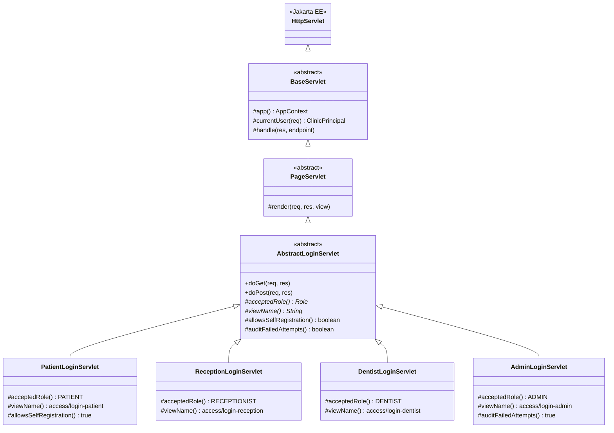
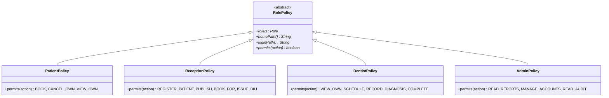

# Software Requirements Specification

**Sunrise Dental Clinic — Appointment & Patient Management System**

| | |
|---|---|
| Module | CIS6003 Advanced Programming |
| Assessment | WRIT1 |
| Document | Master SRS |
| Applies to | `modular/` — the feature-modular implementation |
| Structure | IEEE 830 |

---

## 1. Introduction

### 1.1 Purpose

This document specifies what the Sunrise Dental Clinic system must do, for whom, and under
what constraints. It is the reference the implementation in `modular/` is built and tested
against.

Requirements common to every user are specified here. Requirements particular to one role
are specified in that role's own document, so a developer working on the reception screens
reads one file rather than filtering a combined list:

| Role | Document |
|---|---|
| Patient | [`srs-patient.md`](srs-patient.md) |
| Receptionist | [`srs-reception.md`](srs-reception.md) |
| Dentist (doctor) | [`srs-dentist.md`](srs-dentist.md) |
| Administrator | [`srs-admin.md`](srs-admin.md) |

### 1.2 Scope

Sunrise Dental Clinic is a private dental centre in Colombo treating many patients each
week. Appointments and treatment records are kept on paper, which has produced double
bookings, lost records, long waits and billing errors.

The system replaces that process with one shared record. In scope:

- Authenticated access for four distinct roles, each through its own sign-in portal
- Registration of patients and appointments, each appointment identified by a unique number
- Retrieval of a complete appointment record by that number
- Calculation and printing of a patient's bill
- Guidance for new staff, available without signing in
- Reports supporting clinic decisions
- An audit trail of every change

Out of scope: clinical imaging, prescription management, stock control, payroll, and
integration with any external practice-management or insurance system. Also out of scope for
this release, though the data is collected: **displaying dentist ratings to patients**
(**FR-RVW-11**).

### 1.3 Definitions

| Term | Meaning |
|---|---|
| **Appointment number** | Unique identifier for one visit, format `APT-yyyymmdd-####`, issued per day |
| **Slot** | A bookable time interval produced by dividing a dentist's published session |
| **Session** | A period a dentist is available on one date, published by reception |
| **Treatment** | A priced entry in the clinic's catalogue — the brief's "treatment type" |
| **Consultation fee** | The dentist's own charge, added to every bill |
| **Service charge** | The front-desk handling charge, earned by the receptionist |
| **Revenue split** | Division of a bill's total between dentist, clinic and receptionist |
| **Principal** | The authenticated user of the current request: uid, display name, role |
| **Portal** | A role-specific sign-in page and the screens reachable from it |
| **Patient note** | A medical fact the patient records about themselves — an allergy, a medication they take, a condition. Persistent across visits, distinct from a diagnosis |
| **Complaint** | A concern a patient raises about a dentist or their care. Read by the administrator, never by the dentist it names |
| **Review** | A rating out of five, with an optional comment, that a patient leaves for a dentist after a completed visit. An ordinary quality signal, not a grievance |
| **Diagnosis** | What the dentist found and did at one visit. Written by the dentist, one per appointment |

### 1.4 References

1. CIS6003 Advanced Programming — WRIT1 assessment brief, ICBT / Cardiff Metropolitan University
2. [`er-diagram.md`](../er-diagram.md) — entity-relationship design and the brief-to-column trace
3. `../src/main/resources/schema.sql` — the authoritative database schema
4. Jakarta Servlet 6.0 and Jakarta Pages 3.1 specifications

### 1.5 Document conventions

Requirement identifiers are `FR-<AREA>-<nn>` for functional and `NFR-<AREA>-<nn>` for
non-functional. Role documents use the role's own prefix — `FR-PAT-01`, `FR-REC-01`,
`FR-DEN-01`, `FR-ADM-01`.

Every requirement carries a status, because this document describes both what exists and
what is specified but unbuilt:

| Status | Meaning |
|---|---|
| **Built** | Implemented and covered by a passing test or a verified manual walkthrough |
| **Partial** | Implemented incompletely — the gap is stated in the requirement |
| **Specified** | Agreed and specified here, not yet implemented |

The words *must*, *should* and *may* carry their RFC 2119 force. *Must* is mandatory.

---

## 2. Overall description

### 2.1 Product perspective

A single web application, served from one WAR to a browser. Pages are assembled on the
server; no code runs in the browser beyond what the browser itself does with HTML and CSS.
A JSON web-service layer sits alongside the pages, exposing the same operations to
programmatic callers.

### 2.2 Product functions

Taken from the brief's stated functionality:

1. **User authentication** — no clinical or personal data is reachable without signing in
2. **Register a new appointment** — patient and appointment details captured together
3. **Display appointment details** — searched by appointment number
4. **Calculate and print a bill** — from treatment type and consultation fee
5. **Help** — step-by-step guidance for new staff
6. **Exit** — end the session safely

Extending these, as the brief permits ("Additional functionalities can be included as
needed"): patient self-service booking, published dentist availability, decision-support
reports, an audit trail, and email and SMS notification.

### 2.3 User classes

| Role | Who | Frequency | Competence assumed |
|---|---|---|---|
| **Patient** | A member of the public registered with the clinic | Occasional | None. Screens must be usable without training or instruction |
| **Receptionist** | Front-desk staff | Continuous, all day | Trained on this system; speed matters more than discoverability |
| **Dentist** | A practising dentist at the clinic | Several times a day between patients | Trained; needs their own schedule and nothing else |
| **Administrator** | Clinic owner or manager | Weekly | Trained; reads reports and manages accounts |

### 2.4 Operating environment

| | |
|---|---|
| Server | Java 17, Apache Tomcat 10.1 or later |
| Database | MySQL 8.0 or later, InnoDB |
| Client | Any current desktop or mobile browser; no plug-in, no JavaScript framework |
| Deployment | One WAR, configured entirely by environment variable |

### 2.5 Design and implementation constraints

These are binding, not preferences.

| ID | Constraint |
|---|---|
| **CON-01** | **No application framework may be used.** Dependency wiring, request routing, transactions, JSON serialisation, password hashing and access control are implemented in this project |
| **CON-02** | Web interaction must be by **Jakarta Servlet**. Pages are rendered by JSP with JSTL; no client-side rendering framework |
| **CON-03** | Database access must be **plain JDBC**. No ORM, no persistence framework |
| **CON-04** | Maven for build and JUnit 5 for tests are permitted — a build tool and a test library are not application frameworks |
| **CON-05** | Source must be packaged **by feature**, each module holding its own presentation, business and data tiers |
| **CON-06** | No secret may be committed. Database credentials come from the environment |
| **CON-07** | Views must live under `/WEB-INF/`, unreachable by URL, so no page can render without a servlet having loaded its data |

### 2.6 Assumptions and dependencies

| ID | Assumption |
|---|---|
| **ASM-01** | The clinic operates in one location, one time zone. Times are stored without offset |
| **ASM-02** | Currency is Sri Lankan rupees throughout. No conversion is required |
| **ASM-03** | A patient may hold at most one portal account, matched by email |
| **ASM-04** | A walk-in patient may exist as a record with no portal account at all |
| **ASM-05** | Staff accounts are created by an administrator, never by self-registration |
| **ASM-06** | A dentist's availability is published by reception, not by the dentist |
| **ASM-07** | One appointment yields at most one bill |
| **ASM-08** | Email and SMS delivery depends on an external provider; failure is recorded, never fatal to the operation that triggered it |

---

## 3. External interface requirements

### 3.1 User interfaces

#### 3.1.1 Role-specific sign-in portals

Each role signs in through its own page. The pages are separate servlets rendering separate
views, so each can present the wording, fields and guidance its audience needs — a patient
sees a link to create an account, a dentist does not.

| Route | Portal | Accepts role |
|---|---|---|
| `GET /login` | Portal chooser — four links, no credential fields | — |
| `GET`/`POST` `/login/patient` | Patient sign-in | `PATIENT` |
| `GET`/`POST` `/login/reception` | Reception sign-in | `RECEPTIONIST` |
| `GET`/`POST` `/login/dentist` | Dentist sign-in | `DENTIST` |
| `GET`/`POST` `/login/admin` | Administrator sign-in | `ADMIN` |

| ID | Requirement | Status |
|---|---|---|
| **FR-AUTH-01** | Each portal must authenticate against the single `user_account` table. Four portals, one credential store — a password is not portal-specific | Specified |
| **FR-AUTH-02** | A portal must reject an account whose role does not match it, even when the password is correct | Specified |
| **FR-AUTH-03** | A rejection for wrong role must be **indistinguishable** from a rejection for wrong password. Both return the same message and take comparable time, so a portal cannot be used to discover which role an email belongs to | Specified |
| **FR-AUTH-04** | On success the user must be redirected to their role's home screen, never left on the sign-in page | Built |
| **FR-AUTH-05** | An unauthenticated request for a protected page must redirect to that page's role portal; the same request to `/api/**` must return `401` with a JSON body, because a redirect is useless to a caller expecting JSON | Partial — one portal today |
| **FR-AUTH-06** | Sign-out must invalidate the session and return the user to their portal | Built |

**Design note.** Four portals cost more than one and disclose that four roles exist. The
alternative — one page that routes by the account's role after authentication — is simpler
and leaks less. Separate portals were chosen for the operational reason that the four
audiences are genuinely different: the front desk signs in dozens of times a day and wants
nothing on the page but two fields, while a patient needs registration and help links
beside them. FR-AUTH-03 exists specifically to remove the information disclosure that
separate portals would otherwise introduce. The class structure that implements the four
portals without duplicating the check is specified in §5.2.

#### 3.1.2 General interface requirements

| ID | Requirement | Status |
|---|---|---|
| **FR-UI-01** | Every screen must be reachable from a role-appropriate navigation bar showing the signed-in user's name and role | Built |
| **FR-UI-02** | Data entry and data viewing must be separate screens, not one combined form | Built |
| **FR-UI-03** | Every rejected input must state what was wrong and what to do, beside the field that caused it | Partial |
| **FR-UI-04** | Every destructive action must be confirmed before it takes effect | Specified |
| **FR-UI-05** | The bill must have a print layout that fits one page without the navigation chrome | Partial |
| **FR-UI-06** | Money must render with a thousands separator and exactly two decimal places on every screen | Built |

### 3.2 Web service interface

| ID | Requirement | Status |
|---|---|---|
| **FR-WS-01** | The system must expose its operations as a JSON web service over HTTP, making it a distributed application | Built |
| **FR-WS-02** | Web-service endpoints must be namespaced under `/api/` and must never redirect; they answer with a status code and a JSON body | Built |
| **FR-WS-03** | Endpoints must enforce the same role rules as the equivalent screen. Authorisation belongs to the service, not the page | Built |
| **FR-WS-04** | Requests and responses must be documented with worked examples | Specified |

Endpoint inventory: 16 endpoints across authentication, appointments, availability, patients
and reference data. Full list in the role documents under each role's operations.

### 3.3 Software interfaces

| Interface | Purpose | Failure behaviour |
|---|---|---|
| MySQL 8 over JDBC | All persistent state | Fatal — the request fails with a clear message |
| SMTP server | Appointment confirmation email | Recorded as `FAILED`; the appointment stands |
| SMS gateway over HTTPS | Appointment reminder | Recorded as `FAILED`; the appointment stands |

---

## 4. Functional requirements

### 4.1 Appointments

| ID | Requirement | Source | Status |
|---|---|---|---|
| **FR-APT-01** | Each appointment must be assigned a unique number on creation, format `APT-yyyymmdd-####`, gapless within a day | Brief §2 | Built |
| **FR-APT-02** | Registering an appointment must capture patient name, address, contact number, dentist, treatment type, date and time | Brief §2 | Built |
| **FR-APT-03** | An appointment must be retrievable by its number alone, showing the complete patient and appointment record | Brief §3 | Built |
| **FR-APT-04** | Two appointments must never occupy the same slot. The guard must hold under concurrent booking, not merely sequential | Brief scenario | Built — `SELECT … FOR UPDATE` inside the transaction plus a `UNIQUE` key as backstop |
| **FR-APT-05** | Booking must be rejected with a clear message if the slot was taken between the page loading and the form being submitted | Derived | Built |
| **FR-APT-06** | Cancelling must return the slot to bookable | Derived | Built |
| **FR-APT-07** | An appointment must record who created it and in what role | Derived | Built |
| **FR-APT-08** | Appointment status must follow `CONFIRMED → COMPLETED → BILLED`, with `CANCELLED` reachable from `CONFIRMED` only | Derived | Partial — transitions are not centrally enforced |

### 4.2 Billing

| ID | Requirement | Source | Status |
|---|---|---|---|
| **FR-BIL-01** | The total must be calculated from the treatment's cost and the treating dentist's consultation fee | Brief §4 | Built |
| **FR-BIL-02** | A printable bill must be produced showing patient, appointment, itemised charges and total | Brief §4 | Built |
| **FR-BIL-03** | Each bill must divide its total between dentist, clinic and receptionist and store all three amounts | Derived | Built |
| **FR-BIL-04** | An appointment must not be billed twice | Derived | **Partial** — the `UNIQUE` key stops a duplicate row, but the API answers `201` with a bill id that was never persisted. Verified; see [`api/appointments.md`](../api/appointments.md) |
| **FR-BIL-05** | A bill must only be issuable for a completed appointment | Derived | Partial |
| **FR-BIL-06** | Pricing must be selectable by strategy, so a rule change does not mean editing the billing service | Derived | Built |

### 4.3 Availability

| ID | Requirement | Source | Status |
|---|---|---|---|
| **FR-AVL-01** | Reception must be able to publish a dentist's availability for a date as a session with a start, an end and a slot length | Derived | Built |
| **FR-AVL-02** | Publishing must generate individual bookable slots automatically | Derived | Built |
| **FR-AVL-03** | Only open slots may be offered for booking | Derived | Built |
| **FR-AVL-04** | Publishing must record which member of staff published it | Derived | Built |

### 4.4 Reporting

| ID | Requirement | Source | Status |
|---|---|---|---|
| **FR-REP-01** | Reports must cover income for a period, earnings per dentist, earnings per receptionist, daily takings and patient footfall | Derived | Built |
| **FR-REP-02** | Every report must state the decision it supports, not merely present figures | Derived | Specified |
| **FR-REP-03** | Reports must be exportable as CSV | Derived | Built |
| **FR-REP-04** | Reports must be restricted to the administrator | Derived | Built |

### 4.5 Help and exit

| ID | Requirement | Source | Status |
|---|---|---|---|
| **FR-HLP-01** | A help page must give new staff step-by-step instructions for each task the system performs | Brief §5 | Built |
| **FR-HLP-02** | Help must be reachable without signing in, since a new member of staff may not have credentials yet | Brief §5 | Built |
| **FR-HLP-03** | Help must carry the clinic's contact details for problems the page cannot solve | Derived | Built |
| **FR-EXT-01** | The user must be able to end their session deliberately and be told it ended | Brief §6 | Built |

### 4.6 Notification

| ID | Requirement | Source | Status |
|---|---|---|---|
| **FR-NOT-01** | Booking an appointment must send the patient a confirmation by email | Derived | Partial — recorded, not sent |
| **FR-NOT-02** | An SMS reminder must be sent before the appointment | Specified | Specified |
| **FR-NOT-03** | Every dispatch attempt must be recorded with channel, recipient and outcome | Derived | Built |
| **FR-NOT-04** | Delivery failure must never fail the operation that triggered it | ASM-08 | Built |
| **FR-NOT-05** | Channels must be created through a factory so a new channel needs no change to the calling code | Derived | Built |

### 4.7 Patient medical notes

A patient's medical background — an allergy to a local anaesthetic, an anticoagulant they take,
a heart condition — has to reach the dentist before treatment. It is collected **after** the
patient signs in, from their own profile screen, and never at registration.

| ID | Requirement | Source | Status |
|---|---|---|---|
| **FR-NOTE-01** | A signed-in patient must be able to record medical notes about themselves from their own profile screen | Derived | Specified |
| **FR-NOTE-02** | Registration must **not** collect any medical information. Sign-up stays name, contact, email and password | Derived | Specified |
| **FR-NOTE-03** | Each note must carry a category — allergy, medication, condition or other — so a dentist can scan a list rather than read prose | Derived | Specified |
| **FR-NOTE-04** | A patient must be able to mark a note as critical, meaning it must be seen before treatment | Derived | Specified |
| **FR-NOTE-05** | A patient must be able to edit and delete their own notes. A medical fact that has changed and cannot be corrected is worse than none | Derived | Specified |
| **FR-NOTE-06** | Notes must belong to the patient, not to an appointment, so a fact declared once is visible at every future visit | Derived | Specified |
| **FR-NOTE-07** | When a dentist opens an appointment, that patient's notes must be shown alongside it, without a separate search | Derived | Specified |
| **FR-NOTE-08** | Where any note is marked critical, the dentist's schedule must indicate it **before** the appointment is opened | Derived | Specified |
| **FR-NOTE-09** | A dentist must only read notes for patients on their **own** schedule, not for the whole register | Derived | Specified |
| **FR-NOTE-10** | A dentist must not be able to create, edit or delete a patient's notes. The patient owns their own record; a dentist's clinical opinion belongs in `diagnosis` | Derived | Specified |
| **FR-NOTE-11** | Notes must never be shown to a receptionist or an administrator, on any screen or endpoint | Derived | Specified |
| **FR-NOTE-12** | A patient with no notes must produce an explicit "nothing declared" state on the dentist's screen, not an empty space. Absence of information must be distinguishable from absence of a question | Derived | Specified |

**Design decision, and its cost.** Restricting notes to the treating dentist follows the same
rule as `diagnosis` and is what the clinic asked for. It has a real clinical cost worth stating:
a receptionist preparing a room cannot see a latex allergy, and an administrator auditing an
incident cannot see what was declared. The mitigation is **FR-NOTE-08** — the critical flag
reaches the dentist before treatment begins, which is the moment that matters. If the clinic
later decides reception needs allergy visibility to prepare, that is a change to one method
(`ClinicAccess.canViewPatientNotes`) rather than a change to the schema.

**Why the patient writes them, not staff.** Two reasons. The patient is the only person who
knows their whole history, including treatment elsewhere. And a fact the patient typed is a fact
the patient can correct — a staff-entered note becomes a request to the front desk, which is the
friction the system exists to remove.

### 4.8 Patient complaints

A patient must be able to raise a concern about the dentist who treated them — conduct, a
clinical worry, a wait, a charge — with enough detail for the clinic to act on it.

| ID | Requirement | Source | Status |
|---|---|---|---|
| **FR-CMP-01** | A signed-in patient must be able to raise a complaint naming a dentist they have been treated by | Derived | Specified |
| **FR-CMP-02** | A complaint must carry a category — conduct, clinical concern, waiting time, billing, other — and a free-text account of what happened | Derived | Specified |
| **FR-CMP-03** | A complaint should be linkable to the specific appointment it concerns, chosen from the patient's own history rather than typed | Derived | Specified |
| **FR-CMP-04** | A patient must be able to see the complaints they have raised and the state of each | Derived | Specified |
| **FR-CMP-05** | A complaint must move through `SUBMITTED → UNDER_REVIEW → RESOLVED` or `DISMISSED`, and the patient must see which state it is in | Derived | Specified |
| **FR-CMP-06** | A patient must **not** be able to edit or delete a complaint once submitted. A record of a concern that the complainant can quietly remove is not a record | Derived | Specified |
| **FR-CMP-07** | The administrator must be able to read every complaint, change its state, and record a resolution | Derived | Specified |
| **FR-CMP-08** | **The dentist named in a complaint must never see it** — not the complaint, not its existence, not a count | Derived | Specified |
| **FR-CMP-09** | A receptionist must never see any complaint | Derived | Specified |
| **FR-CMP-10** | Raising a complaint must not affect the patient's ability to book, and must not be visible anywhere in the booking flow | Derived | Specified |
| **FR-CMP-11** | Every read of a complaint must be written to the audit trail, naming who read it | Derived | Specified |
| **FR-CMP-12** | The patient must be told, on the form, who will read the complaint and who will not | Derived | Specified |

**Why the dentist cannot see it — and why this is the opposite rule to §4.7.** Medical notes are
readable by the dentist and hidden from the administrator. Complaints are readable by the
administrator and hidden from the dentist. The two rules point in opposite directions, and
neither follows from seniority:

| Data | Dentist | Reception | Admin | The reason |
|---|---|---|---|---|
| `patient_note` | ✔ reads | ✘ | ✘ | Clinical need. The dentist is treating the patient; nobody else needs an allergy |
| `complaint` | ✘ | ✘ | ✔ reads | Independence. A complaint the subject can read is a complaint most patients will not file |

Access follows **purpose**, not rank. That is the principle worth stating in the report, because
it is what stops "the administrator is senior, so the administrator sees everything" — the
administrator cannot read a diagnosis, and the dentist cannot read a complaint about themselves.

**Attributed, not anonymous.** A complaint carries the patient's identity, because the clinic
cannot investigate what it cannot follow up. Anonymous reporting was considered and rejected on
that ground; the protection offered instead is FR-CMP-08 — the dentist never learns of it — plus
FR-CMP-10, so nothing about the patient's future care visibly changes.

### 4.9 Dentist reviews

After a completed visit a patient may rate the dentist out of five and add a comment. This is
deliberately a different thing from a complaint (§4.8): a rating is routine feedback most
patients will give, a complaint is an exception most will never file.

| ID | Requirement | Source | Status |
|---|---|---|---|
| **FR-RVW-01** | After an appointment reaches `COMPLETED` or `BILLED`, the patient must be able to rate the dentist from 1 to 5 | Derived | Specified |
| **FR-RVW-02** | A comment must be optional. Requiring words suppresses ratings, and a star with no comment is still a signal | Derived | Specified |
| **FR-RVW-03** | At most one review per appointment, so a patient cannot weight the average by repeat submission | Derived | Specified |
| **FR-RVW-04** | A review must not be offered for an appointment that was cancelled or has not happened | Derived | Specified |
| **FR-RVW-05** | Reviewing must be optional and skippable, and never block any other action | Derived | Specified |
| **FR-RVW-06** | A patient must be able to see and change the review they left, up to 30 days after the visit | Derived | Specified |
| **FR-RVW-07** | The system must be able to report, per dentist, the mean rating and the number of reviews | Derived | Specified |
| **FR-RVW-08** | The dentist must see **only their own aggregate** — mean and count — never an individual review, its comment, or who wrote it | Derived | Specified |
| **FR-RVW-09** | The administrator must be able to read individual reviews with their comments, for every dentist | Derived | Specified |
| **FR-RVW-10** | A receptionist must never see any review or aggregate | Derived | Specified |
| **FR-RVW-11** | No rating or aggregate may be shown to patients in this release. The data is collected now and displayed later, if at all | Derived | **Deferred by decision** |
| **FR-RVW-12** | An aggregate must not be published where fewer than five reviews exist, so one bad visit cannot define a dentist | Derived | Specified |

**Reviews and complaints are separate on purpose.** They could have been one table with a
severity flag, and that would have been wrong:

| | Review | Complaint |
|---|---|---|
| Expected volume | most completed visits | rare |
| Purpose | a quality trend | an incident to act on |
| Dentist may see | their own **aggregate** | nothing, ever |
| Needs a resolution | no | yes, in writing |
| Editable by the patient | yes, for 30 days | never |

Merging them would mean either treating a three-star rating as something requiring written
resolution, or treating a safeguarding concern as something the patient can quietly edit. Two
tables, two lifecycles.

**Why the dentist sees the aggregate but not the reviews.** A mean rating is a performance
signal a professional should have. An individual comment, in a clinic with a handful of
appointments a day, identifies its author by date alone — which turns feedback into something a
patient must weigh against their next visit. The aggregate is useful; the comment is
identifying. FR-RVW-12's floor of five exists for the same reason.

**Deferred, and recorded as such.** FR-RVW-11 is not an omission. The clinic wants the data
accumulating from day one so that any future decision about showing ratings has history behind
it. Building the display now would mean guessing at a presentation nobody has asked for; storing
the data now costs one table and cannot be recovered retrospectively if skipped.

### 4.10 Audit

| ID | Requirement | Source | Status |
|---|---|---|---|
| **FR-AUD-01** | Every change to an appointment, bill, availability or account must write an audit record carrying actor, role, action, target and time | Derived | Built |
| **FR-AUD-02** | Audit records must not be editable or deletable through the application | Derived | Built |
| **FR-AUD-03** | The audit trail must answer "who changed this, and when" for any appointment | Derived | Partial — stored, no screen reads it |

---

## 5. Object-oriented design

The brief's marking criteria reward "clear use of object-oriented concepts" and the
application of design patterns "with descriptions and evaluations for each". This section
states those as requirements rather than leaving them to be inferred from the code, and names
the concept each structure demonstrates.

The governing rule: **new behaviour must reuse existing classes, not restate them.** Where a
requirement asks for four variations of something, the invariant part belongs in one place and
only the variation is written four times.

### 5.1 The four pillars, as requirements

| ID | Requirement | Concept | Status |
|---|---|---|---|
| **FR-OOP-01** | Every domain field must be private, reached through accessors. No public mutable state | Encapsulation | Built |
| **FR-OOP-02** | The business tier must depend on repository *interfaces*, never on a JDBC class | Abstraction | Built |
| **FR-OOP-03** | Each repository interface must have at least two implementations — JDBC for production, in-memory for tests — selected at wiring time without changing a caller | Polymorphism | Built |
| **FR-OOP-04** | Behaviour that varies by role must be resolved by polymorphic dispatch, not by an `if` or `switch` on the role value | Polymorphism | **Specified** — 28 `Role.X` checks across 13 servlets today |
| **FR-OOP-05** | Servlets sharing behaviour must inherit it from a common abstract base rather than duplicating it | Inheritance | Built for `BaseServlet`/`PageServlet` |
| **FR-OOP-06** | Where several screens differ only in configuration, the algorithm must live in an abstract superclass and the differences in abstract methods the subclasses supply | Template Method | **Specified** — see §5.2 |
| **FR-OOP-07** | A field that must not reach a role must be absent from the object serialised to it, not merely hidden by the view | Encapsulation | Built — `AppointmentResponse` vs `AppointmentDetailResponse` |
| **FR-OOP-08** | Interchangeable algorithms — pricing, revenue split — must be composed as strategy objects, not selected by conditionals | Strategy, composition | Built |
| **FR-OOP-09** | Object creation with more than three parameters must go through a builder, so a caller cannot transpose two arguments of the same type | Builder | Built |
| **FR-OOP-10** | Every design pattern used must be recorded with where it is applied, why it was chosen over the alternative, and what it costs | — | Specified — §5.5 |

### 5.2 The four sign-in portals: one algorithm, four subclasses

**FR-AUTH-01** to **FR-AUTH-06** require a separate sign-in page per role. Writing four
servlets would repeat the same twenty lines four times, and the fourth copy is where the
security check gets forgotten.

Instead the algorithm is written **once** in an abstract superclass, and each portal supplies
only what differs.

**The algorithm, fixed in `AbstractLoginServlet.doPost`** — this is the Template Method
(**FR-OOP-06**). Every step is identical for all four portals:

1. Read `email` and `password` from the form
2. Call `AuthService.login(email, password)` — the existing service, unchanged
3. If authentication failed, re-render `viewName()` with the generic message
4. If the account's role is **not** `acceptedRole()`, re-render with the **same** generic
   message and take the same time (**FR-AUTH-03**)
5. Call `AuthenticationFilter.establishSession(request, principal)` — existing, unchanged
6. Redirect to `AuthenticationFilter.homeFor(role)` — existing, unchanged

**What a subclass supplies.** Two abstract methods it must implement, two hooks it may
override:

| Member | Kind | Purpose |
|---|---|---|
| `acceptedRole()` | abstract | The one role this portal admits |
| `viewName()` | abstract | Which JSP to render |
| `allowsSelfRegistration()` | hook, default `false` | Patient portal returns `true`, so only that page shows a "create an account" link (**FR-PAT-01**) |
| `auditFailedAttempts()` | hook, default `false` | Admin portal returns `true` (**FR-ADM-04**) |

Each subclass is four to six lines. Step 4 — the role check that makes separate portals safe —
exists once, so it cannot be omitted from one portal.

| ID | Requirement | Status |
|---|---|---|
| **FR-OOP-11** | The four portals must extend a single abstract login servlet holding the whole authentication sequence | Specified |
| **FR-OOP-12** | A subclass must not override the sequence itself, only the abstract methods and declared hooks | Specified |
| **FR-OOP-13** | Adding a fifth role must require one new subclass and one new view, and no edit to the superclass | Specified |

**Views compose rather than inherit.** JSP has no inheritance. The equivalent reuse is a
shared fragment: `access/login-form.jspf` holds the two fields, the submit button and the
error block, and each of the four views includes it and adds only its own heading and links.
Four views of roughly ten lines each, one form defined once.

### 5.3 Role behaviour: polymorphism instead of 28 conditionals

**FR-OOP-04** is currently unmet. Authorisation is expressed as
`AccessControl.require(user, Role.RECEPTIONIST, Role.ADMIN)` in 28 places across 13 servlets,
so no single file answers "what may a receptionist do?".

A call site becomes `user.policy().permits(Action.ISSUE_BILL)` — one message send, dispatched
by the runtime type. Three consequences: each role's authority is stated in one class; a new
action is one method case per policy rather than a hunt through servlets; and the portals get
`loginPath()` and `homePath()` from the same object, so the redirect map stops being a
`switch`.

**Deliberately not done: subclassing the user.** `PatientUser extends User` was considered and
rejected. Roles change — a receptionist is promoted, a dentist is also a patient of the clinic
— and encoding a mutable fact in the type system means changing an object's class to change a
person's job. `UserAccount` stays one class with a `role` field; the *policy* is the hierarchy.
This is the standard trap in role modelling and rejecting it is a design decision, not an
omission.

### 5.4 What is reused unchanged

The portals add no authentication logic. Everything below already exists and is not modified —
which is what makes this an additive change rather than a rewrite:

| Existing class | Reused for | Change |
|---|---|---|
| `AuthService.login()` | Credential verification | none |
| `PasswordHasher` | PBKDF2 hash and constant-time compare | none |
| `LoginAttemptService` | Failed-attempt counting and lock-out | none |
| `AuthenticationFilter.establishSession()` | Putting the principal in the session | none |
| `AuthenticationFilter.homeFor()` | Role-to-home-route mapping | moves into `RolePolicy.homePath()` |
| `UserAccount`, `Role`, `ClinicPrincipal` | Identity | none |
| `PageServlet.render()` | Forwarding to a JSP | none |
| `BaseServlet.handle()` | Exception-to-response mapping | none |

New code required: one abstract servlet, four subclasses, one portal chooser, one shared JSP
fragment, four thin views.

### 5.5 Pattern register

Satisfies **FR-OOP-10** and **NFR-MNT-05**. Every entry names its cost, because a pattern
applied without a stated cost reads as decoration.

| Pattern | Where | Chosen over | Cost |
|---|---|---|---|
| **Template Method** | `AbstractLoginServlet` | Four independent servlets | Behaviour is split across two files; a reader must open the superclass to see what `doPost` does |
| **Strategy** | `BillingStrategy`, `RevenueSplitStrategy` | A `switch` on treatment type | One more indirection between the service and the arithmetic |
| **Factory Method** | `NotificationChannelFactory`, `UserAccountFactory` | `new EmailChannel()` at each call site | An extra type to navigate for a caller that only ever wants one channel |
| **Observer** | `AppointmentEventPublisher` and its observers | Calling the notifier and the auditor inline | Control flow is harder to follow — the booking service no longer names what happens next |
| **Repository / DAO** | `*Repository` interfaces, `*Dao` implementations | Services issuing SQL directly | Boilerplate per entity, and a second class to change when a column is added |
| **Builder** | `Patient`, `Appointment`, `Bill`, `UserAccount` | Long constructors | More code in the domain class than a record would need |
| **Singleton** | `Database` connection pool | A connection per request | Harms test isolation; mitigated by injecting the pool through `AppContext` |
| **MVC / Front Controller** | Servlet + JSP + `AuthenticationFilter` | Logic embedded in JSPs | Three files per screen instead of one |
| **DTO** | `AppointmentResponse`, `AppointmentDetailResponse` | Serialising the domain object | A mapper to maintain — and the five endpoints that skipped it return `toString()` instead of JSON, which is what the omission costs in practice |

### 5.6 Composition where inheritance would be wrong

Inheritance is used for *kinds of the same thing*; composition for *things that have parts*.
Stated so the choice reads as deliberate:

- A service **has** repositories; it does not extend one
- `BillingService` **has** a `BillingStrategy`; there is no `DiscountedBillingService` subclass
- `AppContext` **owns** the object graph by composition — it is the wiring, not a base class
- `Bill` **is composed of** its line amounts; `Appointment` **references** a `Patient` that
  outlives it, which is why the ER design shows composition in one place and aggregation in
  the other

---

## 6. Non-functional requirements

### 5.1 Security

| ID | Requirement | Status |
|---|---|---|
| **NFR-SEC-01** | Passwords must be stored only as a salted PBKDF2 hash with at least 100,000 iterations and a per-user salt. Plaintext must never be stored or logged | Built — 120,000 iterations |
| **NFR-SEC-02** | Hash comparison must be constant-time | Built |
| **NFR-SEC-03** | An account must lock after five consecutive failed attempts and require an administrator to unlock | Built |
| **NFR-SEC-04** | The session cookie must be `HttpOnly` so a scripting flaw cannot read it | Built |
| **NFR-SEC-05** | A session must expire after 30 minutes of inactivity | Built |
| **NFR-SEC-06** | A patient's diagnosis must be visible only to the treating dentist and the patient. It must be excluded by serving a different response object, not by hiding it in a view | Built |
| **NFR-SEC-11** | A patient's medical notes must be readable only by that patient and by a dentist treating them. Enforced by serving a response object that has no field for them, as with `diagnosis` | Specified |
| **NFR-SEC-12** | A complaint must be readable only by the patient who raised it and by an administrator. No response object served to a dentist or a receptionist may carry it, or a count of it | Specified |
| **NFR-SEC-13** | A review's author and comment must never reach the dentist reviewed. The response object served to a dentist carries a mean and a count and no other field | Specified |
| **NFR-SEC-07** | Every state-changing form must carry a CSRF token validated against the session | Specified |
| **NFR-SEC-08** | Authorisation must be checked in the business tier, so no endpoint can be reached by a caller who found its URL | Partial — checks live in servlets |
| **NFR-SEC-09** | Every SQL statement must be parameterised. String concatenation of user input into SQL is forbidden | Built |
| **NFR-SEC-10** | Personal data handling must align with Sri Lanka's Personal Data Protection Act 2022 and the GDPR principles of minimisation and purpose limitation | Specified |

### 5.2 Usability

| ID | Requirement | Status |
|---|---|---|
| **NFR-USE-01** | A receptionist must be able to register an appointment for an existing patient in no more than three screens | Built |
| **NFR-USE-02** | Every error message must be in plain language, naming the problem and the fix. No stack trace or SQL error may reach a user | Partial |
| **NFR-USE-03** | Screens must be legible on a 1366×768 laptop without horizontal scrolling | Built |
| **NFR-USE-04** | A new receptionist must be able to complete every front-desk task using only the help page | Specified |

### 5.3 Performance and reliability

| ID | Requirement | Status |
|---|---|---|
| **NFR-PRF-01** | Any page must respond within two seconds for a clinic-sized dataset under normal load | Built |
| **NFR-PRF-02** | Database connections must be pooled and returned even when a request fails | Built |
| **NFR-REL-01** | Booking must be atomic. A failure part-way must leave no appointment and no consumed slot | Built |
| **NFR-REL-02** | The system must survive restart with no loss of committed data | Built |

### 5.4 Maintainability and portability

| ID | Requirement | Status |
|---|---|---|
| **NFR-MNT-01** | Source must be organised by feature. A change to billing must be possible without opening another module | Specified — the migration target |
| **NFR-MNT-02** | The presentation tier must not reach the data tier. A servlet talks to its service; only a service talks to a repository | Partial — 12 of 20 servlets currently reach a repository directly |
| **NFR-MNT-03** | Business logic must be unit-testable without a database, through in-memory implementations of the repository interfaces | Built |
| **NFR-MNT-04** | Every deployment difference must be an environment variable. The same artefact ships to every environment | Built |
| **NFR-MNT-05** | Design patterns used must be documented with the reason each was chosen and its cost | Specified |

---

## 7. Data requirements

The data design, the cardinality of every relationship and the trace from the brief's
required fields to their columns are in [`er-diagram.md`](../er-diagram.md). In summary:

- Fourteen tables. `user_account` holds identity for all four roles, distinguished by `role`
- `PATIENT` and `DENTIST` have profile tables because they carry attributes an account does
  not. `RECEPTIONIST` and `ADMIN` do not, because they carry none
- Sixteen foreign keys are enforced. Ten further references are plain columns; two of those
  are deliberately unconstrained and seven are a recorded gap

| ID | Requirement | Status |
|---|---|---|
| **FR-DAT-01** | A patient's address and contact number must be stored once, not repeated per appointment | Built |
| **FR-DAT-02** | Treatment type must be a reference to a priced catalogue entry, not free text, so a bill is calculable | Built |
| **FR-DAT-05** | A patient's medical notes must be stored in their own table, cascading with the patient, so a note cannot outlive the person it describes | Specified |
| **FR-DAT-06** | A complaint must survive the deletion of the appointment it concerns, since the appointment record may be tidied long before the concern is closed | Specified |
| **FR-DAT-07** | A review must be uniquely keyed on the appointment it concerns, so FR-RVW-03 is enforced by the database and not by a check that can be raced | Specified |
| **FR-DAT-03** | Every staff reference must be constrained to a real account holding the expected role | Specified — needs a trigger; a foreign key cannot check `role` |
| **FR-DAT-04** | Business rules that belong in the database must be enforced there, using stored procedures, functions and triggers | Specified |

---

## 8. Traceability to the assessment brief

| Brief requirement | Requirements | Role documents |
|---|---|---|
| 1. User authentication (login) | FR-AUTH-01…06, NFR-SEC-01…05 | all four |
| 2. Register new appointment | FR-APT-01, FR-APT-02, FR-AVL-03 | patient, reception |
| 3. Display appointment details | FR-APT-03 | reception, dentist, patient |
| 4. Calculate and print bill | FR-BIL-01, FR-BIL-02 | reception |
| 5. Help section | FR-HLP-01…03 | all four |
| 6. Exit system | FR-EXT-01 | all four |
| Distributed application with web services | FR-WS-01…04 | — |
| Appropriate design patterns | FR-BIL-06, FR-NOT-05, NFR-MNT-05 | — |
| Proper database | §7, FR-DAT-01…04 | — |
| Validation restricting invalid entries | FR-UI-03, and per-role validation tables | all four |
| Reports adding value | FR-REP-01…04 | admin |
| *(beyond the brief)* Patient medical notes | FR-NOTE-01…12, NFR-SEC-11 | patient, dentist |
| *(beyond the brief)* Patient complaints | FR-CMP-01…12, NFR-SEC-12 | patient, admin |
| *(beyond the brief)* Dentist reviews | FR-RVW-01…12, NFR-SEC-13 | patient, dentist, admin |

---

## 9. Out of scope

Stated so absence is not read as omission: clinical imaging and radiographs, prescriptions
and drug interaction checking, stock and materials control, staff payroll and rostering,
online card payment, insurance claim submission, multi-branch operation, and any patient
communication channel other than email and SMS.
